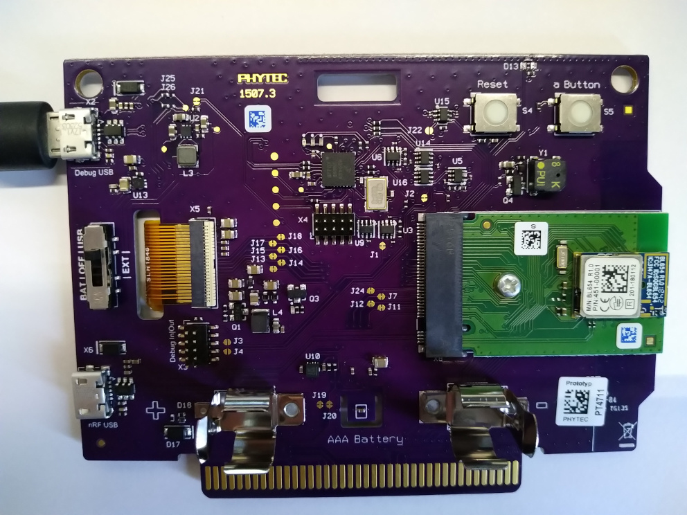
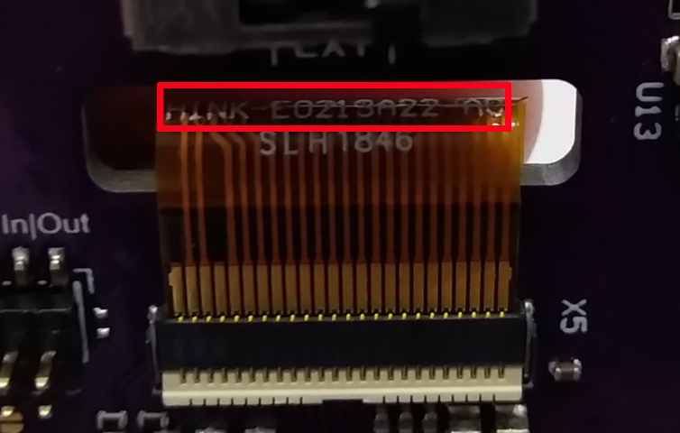

[](https://circleci.com/gh/Rubusch/docker__zephyr__reelboard)
[](https://www.gnu.org/licenses/old-licenses/gpl-2.0.en.html)

# docker__zephyr__phytec-reelboard

Contains a Dockerfile for building an docker image and its container for zephyr.  



Setup for _PHYTEC_ **reel board board v2** (display ribbon cable shows: HINK-E0213**A22**)  



Implicitely will run ```git clone https://github.com/Rubusch/zephyr.git``` inside the docker container.  


## References

https://docs.zephyrproject.org/latest/boards/arm/reel_board/doc/index.html  
https://www.phytec.eu/product-eu/internet-of-things/reelboard/  

Nordec's ARM-CortexM4 nRF52840 datasheet  
https://infocenter.nordicsemi.com/pdf/nRF52840_OPS_v0.5.pdf

## Build

```
$ cd ./docker/
$ time docker build --build-arg USER=$USER -t rubuschl/zephyr-reelboard:$(date +%Y%m%d%H%M%S) .
```

(opt) Append ``--no-cache`` for really re-building the container, which may fix some build bugs  


## Usage

In case of Tag **20191104161353**, enter the container or simply build leaving out the ``/bin/bash``  

```
$ docker images
    REPOSITORY                    TAG                 IMAGE ID            CREATED             SIZE
    rubuschl/zephyr-reelboard    20191104161353      cbf4cb380168        24 minutes ago      10.5GB
    ...

$ docker run --rm -ti --privileged --user=$USER:$USER --workdir=/home/$USER --device=/dev/ttyS0 -v $PWD/configs:/home/$USER/configs -v $PWD/zephyr:/home/$USER/zephyrproject/zephyr rubuschl/zephyr-reelboard:20191104161353 /bin/bash
```

Make sure the device is plugged (/dev/ttyS0 exists)  
NB: Appending ``--privileged`` is not _safe_! Mainly this is used for such things as connecting the USB (nRF tools) the easiest way possible.  
NB: Append ``/bin/bash`` to enter the current container for debugging  


## Target

#### Build example

Example of building the board support package (bsp) for the target, e.g. the reelboard v2  

```
docker $> ./build.sh
```

NB: after re-login needs to execute ``build.sh`` or at least fix all python dependencies are around (TODO to be improved)  


#### Manually build an example  

```
docker $> cd ~/zephyrproject/zephyr
docker $> west build -p auto -b reel_board_v2 samples/basic/blinky
```

Flashing the target  

```
docker $> west flash --erase
```


## Miscellaneous


Serial console 

```
docker $> minicom -D /dev/ttyS0 -b 115200
```

Debug the target  

```
docker $> west debug
```

The Issue: "Waiting for a debug probe to be connected..." is typical for either connected on the wrong USB port, or not running with enough permissions (i.e. without ``--privileged``). Additionally then the udev rule (see references) and membership to the group **plugdev** are needed, which means still a bit work around until this is fixed in the container.  
